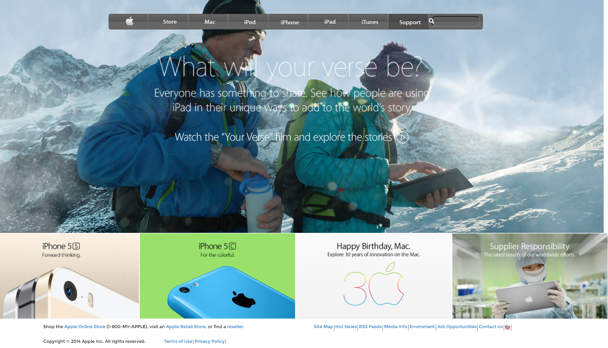

# apple-background

This project consists of building a webpage using images as a background and adding gradients to elements. The goal was to make a clone of old an old version of the Apple website webpage.

The page is very straightforward, so you should be able to clone it even if your CSS skills aren’t perfect.

In this project, our assignment was to make a clone of old an old version of the Apple website webpage.

We worked on all the requirements given on this project.

- We used semantic HTML elements for the header, the main content and the footer.
- We styled the elements to look like the real webpage.
- We used images as a background and adding gradients to elements.

## Built With

- HTML
- CSS: Flex, grid, float, background image and gradients.

## Live Demo

[Live Demo Link](https://daviidy.github.io/apple-background/)

## Authors

👤 **David YAO**

- GitHub: [@daviidy](https://github.com/daviidy)
- Twitter: [@davidyao3](https://twitter.com/DavidYao3)
- LinkedIn: [@daviidy](https://www.linkedin.com/in/david-yao-6bb95299/)
- Personal Website: [@daviidy](http://david-yao.com)

👤 **Sinan Sevgi**

- GitHub: [@sinansevgi](https://github.com/sinansevgi)
- LinkedIn: (https://www.linkedin.com/in/sinan-s-52559437/)
- Twitter: [@nativeofcyber1](https://twitter.com/nativeofcyber1)

## 🤝 Contributing

Contributions, issues, and feature requests are welcome!

Feel free to check the [issues page](issues/).

## Show your support

Give a ⭐️ if you like this project!
